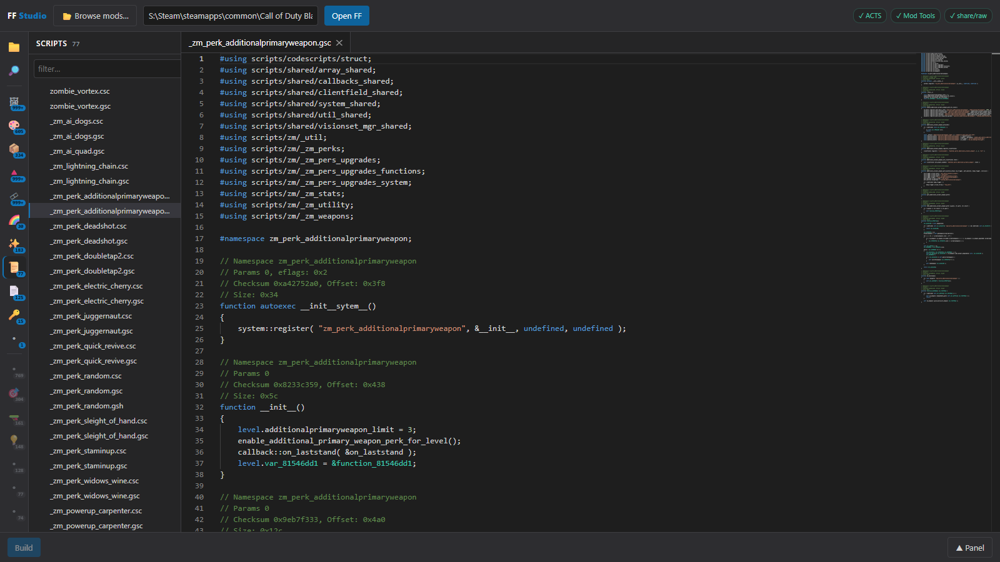
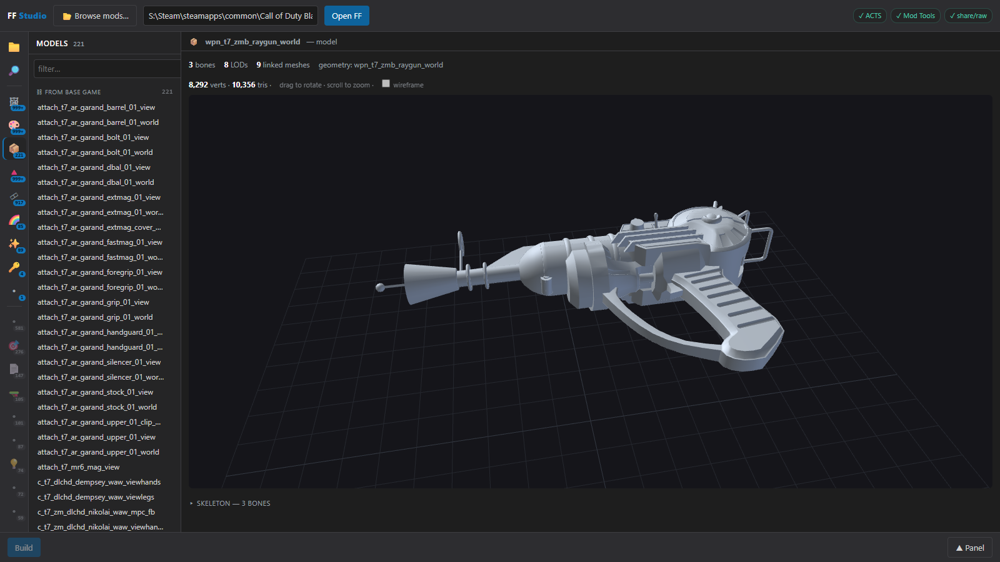

#  FF Studio

A Windows tool for opening closed Black Ops III fastfiles (`.ff`). View the assets inside, edit scripts,
textures and Lua, and build a new drop-in `.ff`. Use it to inspect, fix or maintain mods whose source isn't
available.




## Download

Get `FFStudio.exe` from [Releases](../../releases). No install needed.

GSC script decompile and build also need ACTS and the BO3 Mod Tools (see [Requirements](#requirements)).

## Usage

1. Click **Browse mods…** and pick a fastfile, or paste a `.ff` path and click **Open FF**.
2. Click an asset to view it. Use ⬇ on a row to export it.
3. Edit a script and click **Build** to write a new `.ff`. **Install Studio ff** swaps it in for the original;
   **Restore original** puts the original back.

## What it can do

| Asset | View | Edit |
|---|---|---|
| Scripts (GSC/CSC) | Decompiled source with symbols, go to definition, find references, renaming of hashed names | Edit and rebuild the `.ff` |
| Images | Preview (BC1/BC3/BC4/BC5/BC7, RGBA8), inline or streamed from `.xpak`. Export PNG | Replace (BC1/BC3/RGBA8, same size) |
| Lua (HKS rawfiles) | Disassembly and pseudo-Lua | Recompile and splice back (needs hksc) |
| Models and meshes | 3D view with skeleton and LODs. Export OBJ | — |
| Animations | Keyframe playback on the model's skeleton and skinned mesh | — |
| FX | Element tree, sampled curves, decompiled `.efx`. Export `.efx` | — |
| Materials, techsets | Textures used; DXBC shader breakdown | — |
| Fonts | Glyph preview. Export TTF | — |
| String tables | Table grid | — |
| Other rawfiles, key-value pairs | Text, hex or field view. Export raw | — |

Also:
- Asset list by type, with mod-added assets marked separately from base-game ones.
- Mods made of several fastfiles (e.g. `core_mod.ff` + `zm_mod.ff`) open as one workspace.
- Base-game fastfiles can be browsed (read-only).

## What it can't do

- **No viewer** for: weapons, attachments and camos; sounds; physics presets; vehicles; AI, characters,
  animation state machines and behaviour trees; script bundles; lights and lens flares; tracers; xcams; map data
  (world geometry, collision, map entities, navmesh); localized strings. These show in the asset counts only.
- Only scripts, textures and Lua can be edited.
- Base-game fastfiles can't be edited.
- Geometry stored in a different fastfile isn't shown unless it's in a shared base-game fastfile. Collision
  meshes aren't drawn.
- Animation root motion isn't played.
- FX curves are the baked samples, not the FX editor's original control points.
- Pseudo-Lua shows control flow as labels and gotos, not rebuilt `if`/`while` blocks.
- BC5 and BC7 textures can't be replaced.
- String table cells whose hash matches more than one string are marked as a best guess.

## Requirements

Windows. The exe includes Python and all packages. These are separate downloads, and are only needed for the
features listed:

| Tool | Needed for | Setup |
|---|---|---|
| [ACTS](https://github.com/ate47/atian-cod-tools) **v3.2.1** | GSC decompile and build | Download [`acts.zip`](https://github.com/ate47/atian-cod-tools/releases/download/3.2.1/acts.zip) and extract it so `acts\bin\acts.exe` is next to `FFStudio.exe` (or in the repo root when running from source). |
| BO3 Mod Tools | GSC build | Install from Steam. Found automatically. |
| [hksc](https://github.com/Jake-NotTheMuss/hksc) | Lua recompile | Build it for T7 and put `hksc.exe` in a `tools\` folder next to the exe (or in the repo root), or set `HKSC_PATH`. |

The app lists anything missing on startup with what to do.

## Running from source

Needs Python 3.8+.

```bash
pip install -r requirements.txt
python src/ffstudio_app.py
```

`src/ffstudio_app.py` opens a desktop window; `src/ffstudio.py` runs the browser version. To build the exe, run
`packaging\build_exe.bat` (output: `dist\FFStudio.exe`). See [docs/PACKAGING.md](docs/PACKAGING.md).

```
src/          application code and UI
packaging/    exe build script and PyInstaller spec
docs/         packaging notes, icon and screenshots
```

A `_studio_cache\` folder is created next to the exe (or in `src\` from source) for decompile caches. It's safe
to delete.

## License

[MIT](LICENSE). three.js (`src/three.min.js`) is MIT licensed. ACTS, hksc and the BO3 Mod Tools are not included.

FF Studio is not affiliated with or endorsed by Activision or Treyarch.
